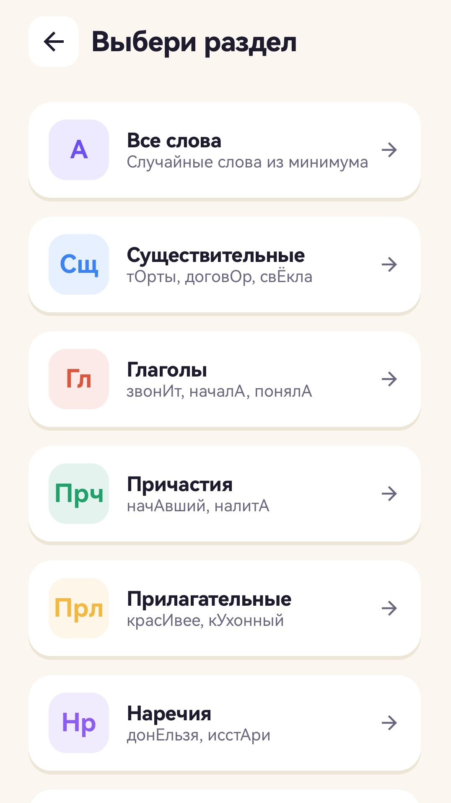
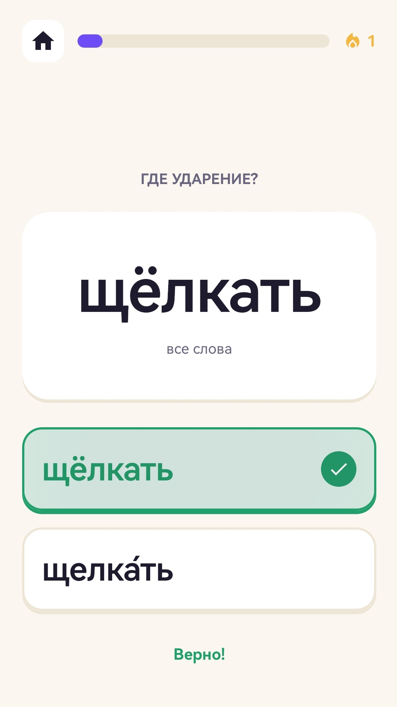
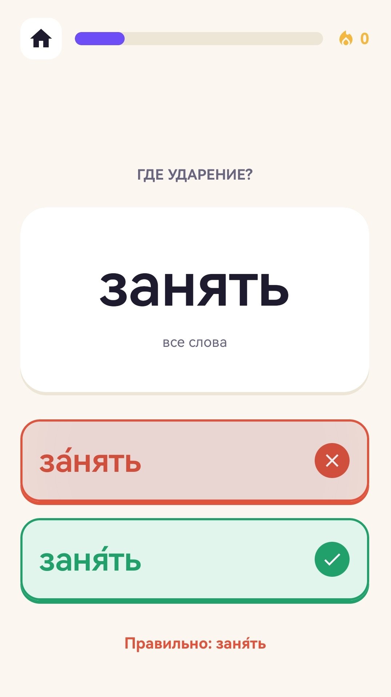
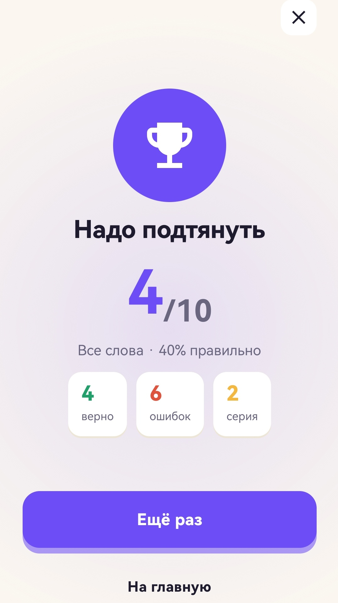

# Ударения ЕГЭ — тренажёр орфоэпии для ЕГЭ

## Скриншоты

<table>
  <tr>
    <th>Старт</th>
    <th>Выбор категории</th>
    <th>Правильный ответ</th>
  </tr>
  <tr>
    <td></td>
    <td></td>
    <td></td>
  </tr>
  <tr>
    <th>Неправильный ответ</th>
    <th>Результат</th>
    <th></th>
  </tr>
  <tr>
    <td></td>
    <td></td>
    <td></td>
  </tr>
</table>

## Функциональность

1. Квиз на постановку ударения — слово + варианты, один из которых верный (задание №4 ЕГЭ, орфоэпический минимум)
2. 7 категорий: все слова целиком и 6 частей речи по отдельности (существительные, глаголы, причастия, прилагательные, наречия, деепричастия)
3. Колода на прохождение — 10 случайных слов из выбранной категории
4. Стрик правильных ответов внутри игры + стрик дней подряд между заходами в приложение, лучший результат сохраняется
5. Экран результата с процентом верных ответов и текстовой оценкой («Превосходно!», «Хороший результат» и т.д.)
6. Звуковые эффекты правильного/неправильного ответа генерируются на лету (синусоида через `AudioTrack`), без аудиофайлов в APK
7. Работает офлайн — база слов вшита в APK и не требует сети
8. Показ рекламы Yandex Mobile Ads (баннер на экранах + межстраничная реклама через раз при повторном прохождении)

## Стек


## Архитектура

Четыре Gradle-модуля, зависимости идут в одну сторону: `data → domain ← presentation ← app`.

- **domain** — чистый Kotlin, без Android-зависимостей. Сущности `Word` (слово + часть речи + варианты ударения), `Variant`, `Category` (7 категорий, каждая опционально привязана к `PartOfSpeech`), `QuizResult`, `UserProgress`. Интерфейсы репозиториев (`WordsRepository`, `UserProgressRepository`) и use-case'ы: `GetWordsUseCase`, `GetQuizDeckUseCase` (случайная колода из 10 слов категории), `CompleteQuizUseCase` (пересчитывает стрик дней и агрегирует статистику), `ObserveUserProgressUseCase`.
- **data** — две независимые Room-базы. `AppDatabase` (`words.db`) — заранее подготовленная и только читаемая база слов, разворачивается из `assets/ege_stress.db` (`createFromAsset` + `fallbackToDestructiveMigration`, так как контент неизменяемый). `UserDatabase` (`user.db`) — прогресс пользователя и история пройденных квизов, с обычными миграциями. Мапперы прячут DB-модели за доменными сущностями, `*RepositoryImpl` реализуют интерфейсы из `domain`.
- **presentation** — экран = пакет `screen/<name>/` с Compose-функцией, `ViewModel` и `<Name>Contract` (`State` + `Intent` + `Effect`). ViewModel принимает `Intent` через `processIntent`, обновляет `StateFlow`, разовые события (навигация, показ рекламы) шлёт через `Channel` как `Effect`. Отдельно вынесены звуковые эффекты (`SoundEffects`) и обёртки над Yandex Ads (`AdBanner`, `InterstitialAdManager`).
- **app** — точка входа: `Application` (инициализация Yandex Ads SDK), `MainActivity`, сборка графа Hilt.

DI — Hilt (`@HiltAndroidApp`, `@HiltViewModel`, модули `DatabaseModule`/`RepositoryModule`), в отличие от чисто учебных проектов с ручным контейнером.

Навигация — `Navigation Compose` с обычными строковыми роутами (`quiz/{category}`), категория передаётся как `NavType.StringType` и парсится обратно в `Category` во ViewModel.

## Как собрать и запустить

Требования: Android Studio (актуальная версия с поддержкой Kotlin 2.3 / KSP), JDK 17+.

- `minSdk` 28, `targetSdk` / `compileSdk` 36.
- База слов — локальная (Room, предзаполнена из `assets/ege_stress.db`), сервер не нужен.
- Для сборки release нужен `local.properties` с путём и паролями к keystore (`ACCENTS_KEYSTORE_PATH`, `ACCENTS_KEYSTORE_PASSWORD`, `ACCENTS_KEY_ALIAS`, `ACCENTS_KEY_PASSWORD`) и ID рекламных блоков Yandex (`YANDEX_BANNER_AD_UNIT_ID`, `YANDEX_INTERSTITIAL_AD_UNIT_ID`) — без них подставляются demo-ID и сборка debug работает без правок.

```powershell
.\gradlew.bat assembleDebug          # собрать debug APK
.\gradlew.bat installDebug           # собрать и поставить на подключённое устройство/эмулятор
.\gradlew.bat test                   # юнит-тесты
.\gradlew.bat connectedAndroidTest    # instrumented-тесты (нужен эмулятор/устройство)
```

Либо открыть проект в Android Studio и запустить конфигурацию `app` на эмуляторе/устройстве с API 28+.

## Известные ограничения / что не реализовано

- **Нет тёмной темы** — `AccentsAppTheme` собран только на `lightColorScheme`, переключателя темы в приложении нет.
- **Нет синхронизации и бэкапа** — прогресс и история квизов хранятся только локально, в Room; без сети и облака.
- **База слов статична** — пополняется только пересборкой `ege_stress.db`, добавить или отредактировать слово из приложения нельзя.
- **Нет полноценных тестов** — в модулях лежат только сгенерированные Android Studio заглушки (`ExampleUnitTest`, `ExampleInstrumentedTest`), логика use-case'ов не покрыта.
- **Показ межстраничной рекламы захардкожен** — правило «через раз» на экране результата (`playAgainCount % 2`) зашито в `InterstitialAdManager`, без A/B-конфигурации или удалённого управления частотой.
- **Нет type-safe навигации** — маршруты и аргументы (`quiz/{category}`) собираются вручную строками, а не через `kotlinx.serialization`-маршруты.
